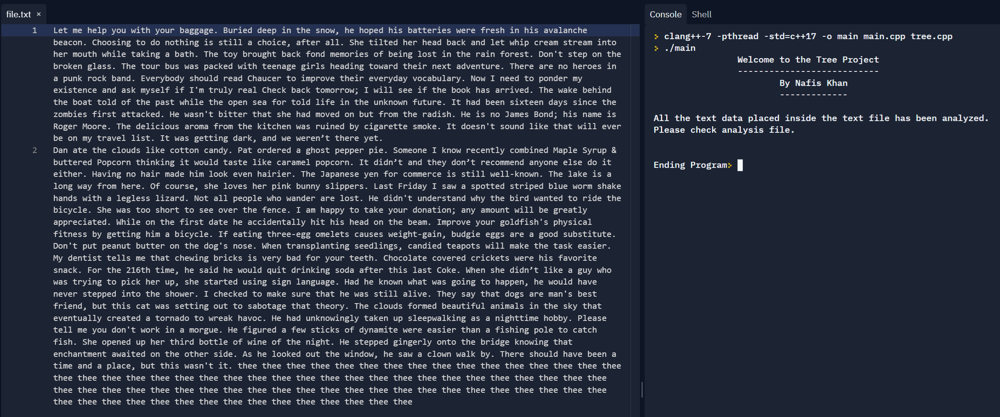
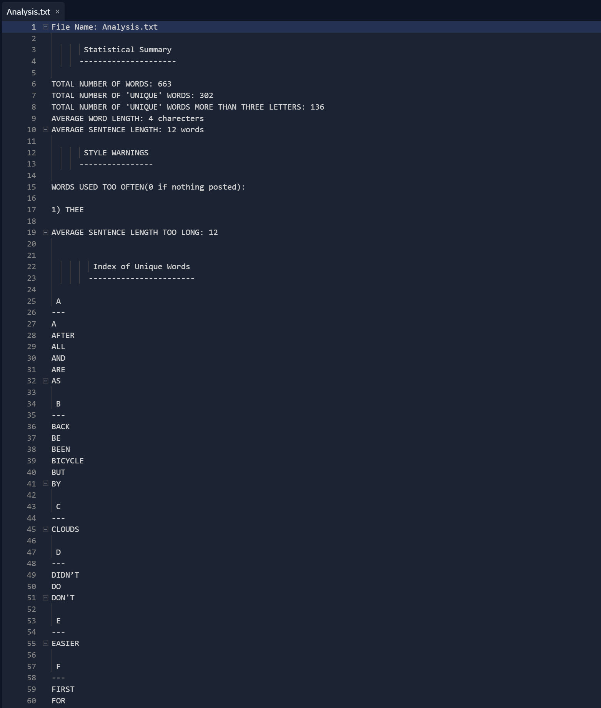
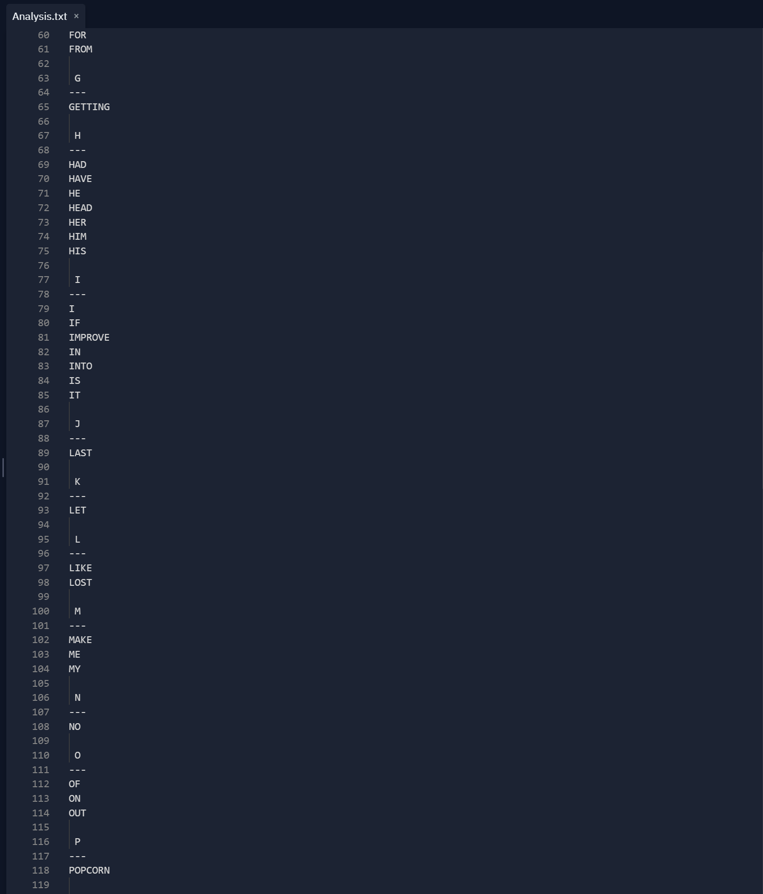
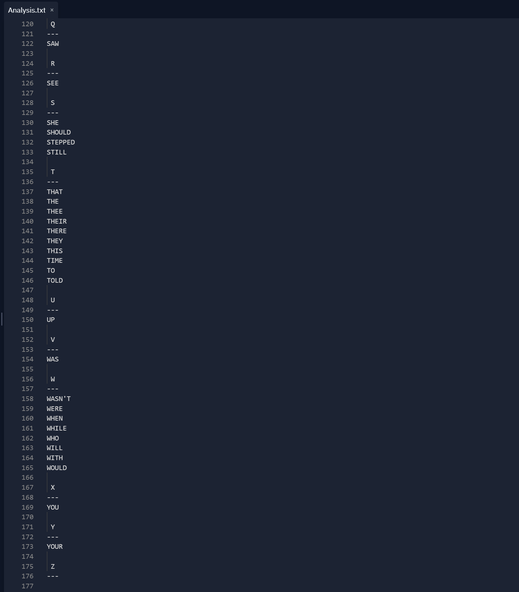

# Analyze-Sentences-Using-Trees

This project uses Binary Trees to analyze sentences. All the text has to be put into the file.txt file to be analyzed. A new file is created when the analysis is complete with an extensive review of the wording and sentences found inside the data given.

It seperates the texts put into the file.txt file and puts each word in a tree to analyze and tell the client things like how many words/sentences there are, the averages of them, repeating words, etc.

Two main classes are used in this project. The first is the node class (which could also be a simple struct) which contains a pointer to the left and right child of the tree, an information container and a counter (counts if there are repeating words). The second is the tree class that seperates everything to produce the results needed.

I have tried to put in as many comments as possible to make the code easier to understand, if you still have any questions please let me know. I also added some repeating texts in the file.txt file so that the program can display as much of its functions as possible to the user. The program also takes into account for some punctuations like periods and commas. If you want, you can add functionality for more easily.

Text Data given to project:

Report Produced from Data:

